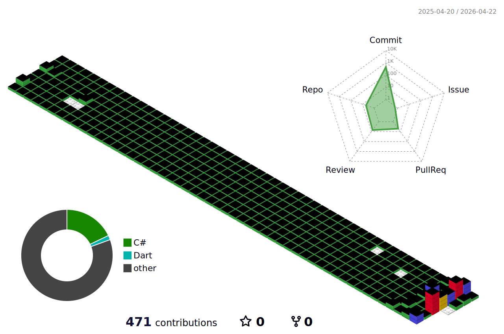

### Hi there 👋🏻 I'm Soosembly
주니어 데이터 사이언티스트로서 데이터 분석과 머신 러닝 분야에서 경력을 쌓아가고 있습니다.
 
Hi, I'm a junior data scientist pursuing a career in data analytics and machine learning.

   
## 👩🏻‍💻 About me
- Architectural Engineering Major in Korea
- Institut de Français Langue Étrangère in France
- L'École de design Nantes Atlantique in France
- Architectural Design and Supervision in Korea
- Complete the Data Scientist track at Year-Dream School(Korea SMEs and Startups Agency)

   
## 🎯 Projects

| Task | Title | Host |
|--|--|--|
|동영상 로고(객체) 인페인팅|[Video-Inpainting](https://github.com/Soosembly/PJT-Video-Inpainting)|커넥트브릭 & [마인즈앤컴퍼니](https://mnc.ai/)|
| 🍋 | 🍋 | 🍋 |
| 🍒 | 🍒 | 🍒 |

   
## 🧗🏻‍♀️ Tech Stack
      

    

### 🤸🏻‍♀️ Other Skills 
   

   

 

   
## 📬 Contact

[🔗 Blog_portfolio](https://greennesson.com/portfolio/)
 
[🔗 LinkedIn](https://www.linkedin.com/in/%E2%9D%9Dsoojin-son%E2%9D%9E/)

   
## 🌱🌱🌱

<!--
**Soosembly/Soosembly** is a ✨ _special_ ✨ repository because its `README.md` (this file) appears on your GitHub profile.

Here are some ideas to get you started:

- 🔭 I’m currently working on ...
- 🌱 I’m currently learning ...
- 👯 I’m looking to collaborate on ...
- 🤔 I’m looking for help with ...
- 💬 Ask me about ...
- 📫 How to reach me: ...
- 😄 Pronouns: ...
- ⚡ Fun fact: ...
-->
