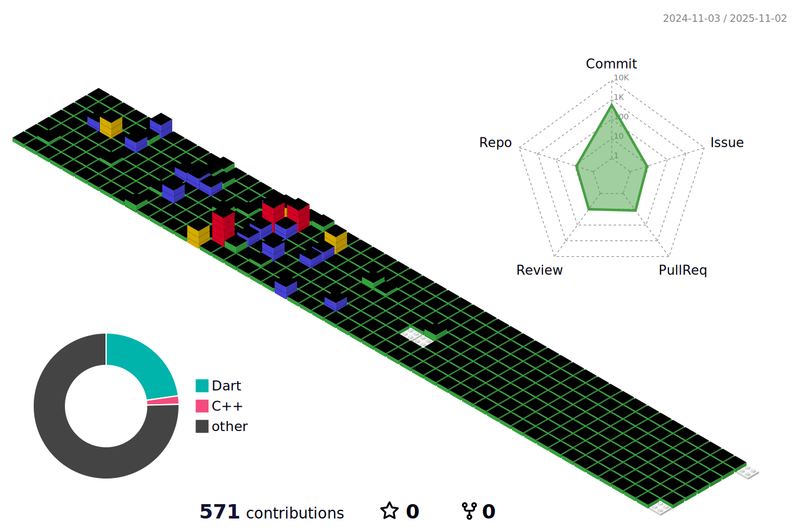

### Hi there 👋 I'm Soosembly
안녕하세요, 저는 주니어 데이터 사이언티스트로서 데이터 분석과 머신 러닝 분야에서 경력을 쌓아가고 있습니다.
 
Hi, I'm a junior data scientist pursuing a career in data analytics and machine learning.

<!--
**Soosembly/Soosembly** is a ✨ _special_ ✨ repository because its `README.md` (this file) appears on your GitHub profile.

Here are some ideas to get you started:

- 🔭 I’m currently working on ...
- 🌱 I’m currently learning ...
- 👯 I’m looking to collaborate on ...
- 🤔 I’m looking for help with ...
- 💬 Ask me about ...
- 📫 How to reach me: ...
- 😄 Pronouns: ...
- ⚡ Fun fact: ...
-->
